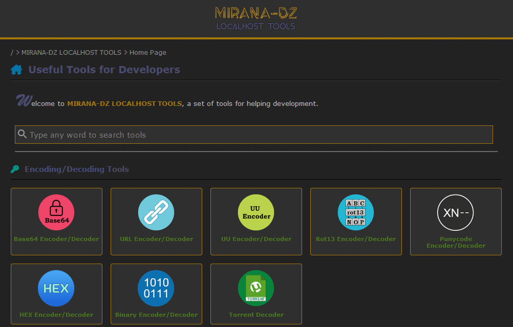
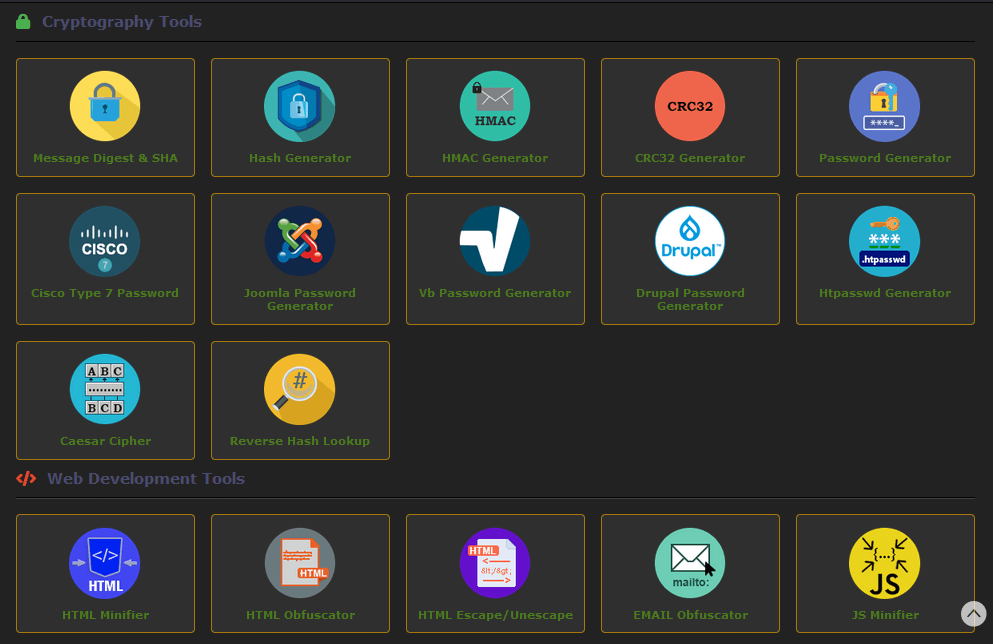

English | [العربية](./README-AR.md)

  
  <h1>Welcome to Localhost Tools 🧰🛠️</h1>

MIRANA-DZ LOCALHOST TOOLS is a comprehensive collection of powerful tools designed to facilitate web development, network security, image editing, OSINT, AI, and torrent handling tasks.

This project combines the power of PHP, HTML, and JavaScript to provide users with an all-in-one toolset. With a range of tools for encoding/decoding, cryptography, web development, image editing, network tools, pentesting, OSINT, AI, and torrent handling, this collection is a must-have for developers, network administrators, security experts, investigators, and researchers.

## Screenshot

  
  

## Table of Contents

- [Tools list](#user-content-tools-list)
  - [Encoding/Decoding Tools](#user-content-encodingdecoding-tools)
  - [Cryptography Tools](#user-content-cryptography-tools)
  - [Web Development Tools](#user-content-web-development-tools)
  - [Images Tools](#user-content-images-tools)
  - [Network Tools](#user-content-network-tools)
  - [Pentesting Tools](#user-content-pentesting-tools)
  - [OSINT Tools](#user-content-osint-tools)
  - [AI Tools](#user-content-ai-tools)
  - [Miscellaneous Tools](#user-content-miscellaneous-tools)
- [Requirements](#user-content-requirements)
- [Changelog](#user-content-changelog)
- [PSD files](#user-content-psd-files)
- [Reporting Bugs & Feature Requests](#user-content-reporting-bugs--feature-requests)

  

## Tools list
List of all available tools in MIRANA-DZ Localhost Tools.

Tools count: +60

### Encoding/Decoding Tools
- Base64-58-32 Encoder / Decoder
- URL Encoder / Decoder
- UU Encoder / Decoder
- ROT13 Encoder / Decoder
- Punycode Encoder/Decoder
- HEX Encoder/Decoder
- Binary Encoder/Decoder
- Torrent Decoder

### Cryptography Tools
- Message Digest
- Hash Generator
- HMAC Generator
- CRC32 - CRC32B - CRC32C Generator
- Password Generator
- Cisco Type 7 Password
- Joomla Password Generator
- Vb Password Generator
- Drupal Password Generator
- Htpasswd Generator
- Caesar Cipher
- Reverse Hash Lookup
- Password Decoder

### Web Development Tools
- HTML Minifier
- HTML Obfuscator
- HTML Escape / Unescape
- EMAIL Obfuscator
- JS Minifier
- CSS Minifier
- CSS Text Shadow
- PHP Obfuscator 1

### Images Tools
- Image to Base64 / Base64 to Image
- Images Converter
- Image Resizer
- Image Color Picker
- Share Images

### Network Tools
- IP Address Converter
- HTTP Header Status Checker
- Ping Tool
- Ports List
- IP Geolocation
- Whois Lookup
- Subdomain Finder

### Pentesting Tools
- Admin Finder
- Zip Path Traversal
- Website Malware Checker
- Google Dorking
- Default Router Settings
- Default Credentials

### OSINT Tools
- Search Engines
- Reverse Image Search
- Images Search
- Video Search
- Torrent Search
- Cached Pages
- Search phone number

### AI Tools
- Email Generator
- English Teacher
- Translator

### Miscellaneous Tools
- My Bookmarks
- Bat Obfuscator
- Lists and Tables

## Requirements
Apache2 webserver 

PHP version 8 or higher with following extensions enabled and dependencies :
- cURL Extension
- Fileinfo PHP Extension
- ZIP PHP Extension
- Dom PHP Extension
- GD PHP Extension
- mbString PHP Extension
- intl PHP Extension
- guzzlehttp
- tuupola/base32 & tuupola/base58

## Changelog
See [Changelog](./CHANGELOG.md).

## Credits
See [Credits](./CREDITS.md).

## PSD files
Source \*.PSD files for all images and icons used in this project are included in the resources directory. You can modify/redistribute it however you like.  

## Reporting Bugs & Feature Requests
If you have found an issue or would like to request a new feature, simply create a new issue. Be sure to fill out as much information as possible.
Note that this project is mostly a WIP, but suggestions and improvements are welcome.